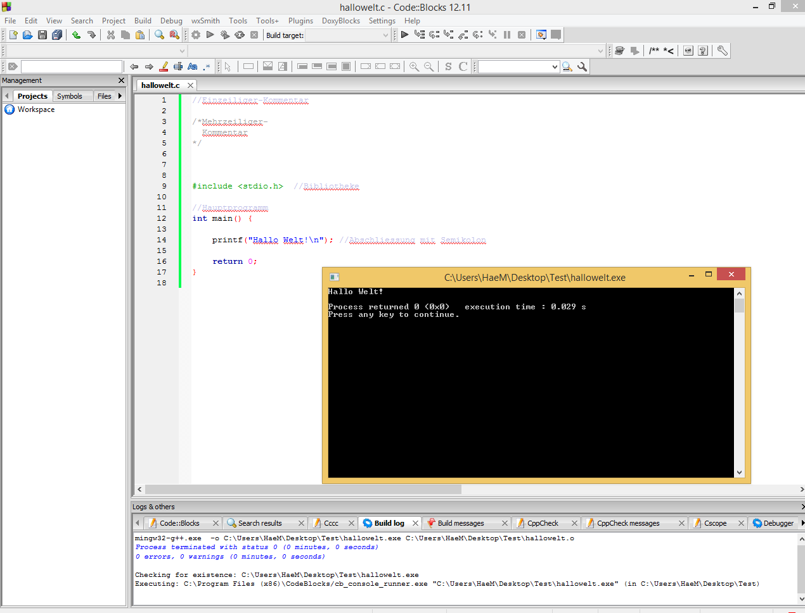

C Programmieren
===============

###Was ist C überhaupt?

C ist eine imperative Programmiersprache (Befehlorientierte Programmiersprache). Einige andere Sprachen wie C++, Objective-C und C# orientieren sich an C.
Sie ist die Grundsprache aller C lastigen Programmiersprachen, da die für Betriebsysteme genutzt wird.
Bevor man richtig mit C-Programmiert muss man richtige Werkzeuge und Grundwissen besitzen. Zuerst braucht man eine Programmierer Oberfläche (IDE = integrated development enviroment), diese beinhaltet:
* Texteditor
* Compiler
* Linker
* Debugger
* Quelltextformatierungsfunktion

###Texteditor, Compiler was ist das?

Beim Texteditor handelt es sich um die Schreibfläche, wo man neue .c files schreibt. Der Compiler ist der Übersetzter. Von unserer C-Syntax (z.B. printf("")) ins 0 und 1 umwandeln. Weil der Computer nur dieses "Sprache" spricht, braucht es einen Compiler, der von unseren Befehlen ins Binärsystem umwandelt.


###Grundgerüst

| Was? | Beschreibung |
| ---- | ------------ |
| #include <stdio.h> | einbinden einer Bibliothek |
| int main () | Hauptprogramm/ Hauptfunktion |
| {} | Anfang und Ende einer Funktion |
| ; | Abschliessung jedes Befehles (Semikolon) |
| return 0; | Zürckgabewert: 0 |



**Zusatz Befehle**

| Was? | Beschreibung |
| ---- | ------------ |
| /* \* / | Mehrzeiliger Kommentar, wird vom Compiler ausgelassen |
| // | Kommentar, wird vom Compiler ausgelassen |
| printf("") | Etwas in Textform ausgeben |
| system("pause") | Bei anwendung von .exe Programm startet ohne zu schliessen |

###Hello World!

Das waren die zwei "Worte" die das erste B Programm (Vorgänger von C) ausgab. Bis heute ist es die bekannteste Ausgabe mit C.
Nun gehts auch los:

Quellcode:

```c
#include <stdio.h>

int main() {
  printf("Hello World!");
  return 0;
}
```

Ausgabe:


